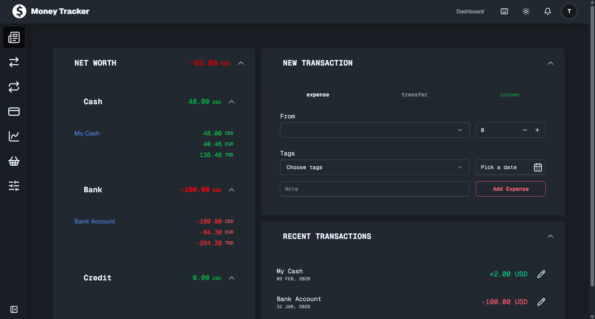
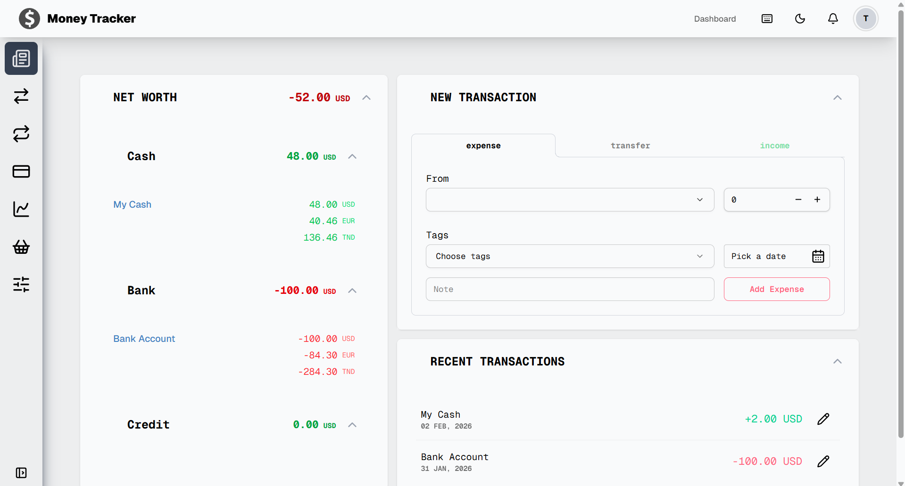

# Money Tracker App with next.js and express.js

A full-stack personal finance app built with **Next.js 16** and **Express.js 5**. Track income, expenses, and transfers across multiple accounts and currencies — with budgets, recurring transactions, and visual reports.



<details>
<summary>Light Mode</summary>



</details>

---

## ✨ Features

- **Transaction Tracking** — Log expenses, income, and inter-account transfers with custom tags, notes, and dates
- **Recurring Transactions** — Automate repeating transactions (daily, weekly, monthly, yearly) via cron jobs
- **Budgeting** — Set monthly spending limits per tag with alerts at 80% and 100% thresholds
- **Reports & Charts** — Net worth trends, income vs. expense breakdowns with monthly/yearly filtering (Recharts)
- **Dark/Light Theme** — Full theme support via `next-themes` + DaisyUI
- **Keyboard Shortcuts** — Power-user shortcuts for quick navigation

---

## 🛠 Tech Stack

| Layer | Technologies |
|---|---|
| **Frontend** | Next.js 16 (App Router), TypeScript, Tailwind CSS v4, DaisyUI v5 |
| **Animations** | GSAP, Framer Motion, Lenis smooth scroll |
| **State** | Zustand (client), TanStack React Query (server) |
| **Forms** | React Hook Form + Zod validation |
| **Backend** | Express.js 5, Node.js (ES Modules) |
| **Database** | MongoDB (Mongoose) |
| **Auth** | Better Auth (session-based, HTTP-only cookies) |
| **Scheduling** | node-cron (exchange rates + recurring transactions) |
| **Security** | Helmet, express-rate-limit |


## 🚀 Getting Started

### Prerequisites

- **Node.js** (v18+)
- **MongoDB** (local or Atlas)
- An exchange rate API key (for multi-currency support)

### Setup

1. **Clone the repo**
   ```bash
   git clone https://github.com/your-username/money-tracker.git
   cd money-tracker
   ```

2. **Install dependencies**
   ```bash
   cd frontend && npm install
   cd ../backend && npm install
   ```

3. **Configure environment variables**

   Copy the example and fill in your values:
   ```bash
   cp backend/example.env backend/.env
   ```

   ```env
   PORT=3000
   NODE_ENV="development"
   MONGO_URI="your-mongodb-uri"
   EXCHANGE_RATE_API_KEY="your-api-key"
   BETTER_AUTH_SECRET="random-secret-string"
   CLIENT_URL="http://localhost:3000"
   BETTER_AUTH_URL="http://localhost:3000"
   ```

4. **Run the app**
   ```bash
   cd backend
   npm run dev
   ```
   The app will be available at `http://localhost:3000`.

---

## 🗺 Roadmap / Ideas

- [ ] Data export (CSV/PDF)
- [ ] Making a local version
- [ ] Mobile-responsive improvements
- [ ] Cleaner Code

---

## 📝 License

This project is open source and available under the [MIT License](LICENSE).

---

**Built as a learning project and maybe after some polishing it will be a port of my portfolio** — feedback and suggestions are very welcome! 🙌
(this is still in development btw)
